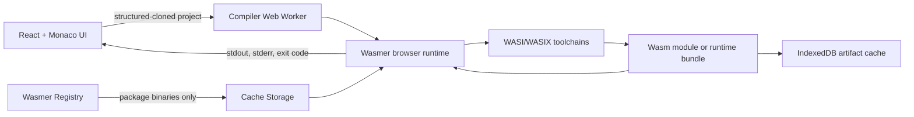

# Architecture

## Data flow

The UI never imports a compiler or runtime directly. It sends an immutable project snapshot to a dedicated module Worker. The Worker owns the Wasmer `Runtime`, package handles, mounted `Directory` instances, compiler processes, and generated binaries. Cancelling an operation or changing toolchain/target terminates and recreates that Worker, so guest state and accumulated runtime resources never leak into the next toolchain session.

## Compilation pipelines

### C and C++

1. Mount all project files at `/project`.
2. Run the pinned `clang/clang@0.160000.1` toolchain through Wasmer.
3. For plain WASI, invoke Clang's integrated `-cc1` frontend once per translation unit and invoke the packaged `wasm-ld` command explicitly. This avoids an unverified subprocess path in the non-asyncified full compiler while preserving the exact Clang driver contract.
4. Read `/project/build/app.wasm` back through Wasmer's `Directory` API.
5. Parse Clang diagnostics into filename, line, column, severity, code, and message.

Plain WASI uses the package's full `clang-16` frontend with an explicit `wasm32-unknown-wasi` triple, sysroot, and a separate linker process. WASIX uses the package's asyncified `clang` entrypoint and its WASIX thread/shared-memory flags.

### Rust/WASI core profile

The core-profile frontend is a deterministic local translator executed by the pinned CPython/WASI package. It emits C17 with `#line` mappings so downstream Clang diagnostics still point to the Rust file. Unsupported Rust constructs are rejected before code generation. The translated unit then follows the same Clang and linker pipeline as C.

This profile exists because a complete browser-runnable `rustc`, standard library, and Cargo toolchain is not published as a Wasmer package. The product makes that boundary visible instead of routing source to a server or pretending to provide full Rust.

### Python

The browser-compatible CPython 3.12/WASIX package (`python/python@=0.2.0`) runs `py_compile` against every `.py` file inside the mounted project. The artifact contains the byte-compiled entry, byte-compiled modules, source modules needed for Python imports, a manifest, and the exact runtime package identifier. Execution mounts the bundle and launches its entry with Wasmer.

### JavaScript and TypeScript

The pinned TypeScript compiler source is served as a versioned, same-origin toolchain asset and cached by the toolchain service worker. The compiler Worker mounts it into QuickJS and launches QuickJS through Wasmer. TypeScript's `transpileModule` returns ES2020 modules and structured diagnostics without executing user code during the build. JavaScript goes through the same syntax pipeline. Execution mounts the emitted modules and launches QuickJS with module mode.

## Storage

IndexedDB has two object stores:

- `projects`: autosaved project snapshots keyed by project ID.
- `artifacts`: content-addressed build products keyed by SHA-256 of canonical files and build configuration.

The artifact store retains the 20 newest builds. Cache Storage holds GET responses from the Wasmer registry/CDN, which includes compiler binaries, runtime modules, sysroots, and standard libraries. Browser persistent-storage permission is requested at startup.

## Security and privacy boundaries

- The deployed response sets `Cross-Origin-Opener-Policy`, `Cross-Origin-Embedder-Policy`, `Cross-Origin-Resource-Policy`, `Referrer-Policy`, and `X-Content-Type-Options`.
- Guest programs see only explicit in-memory mounts and configured stdin, arguments, and environment variables.
- Source paths are normalized and cannot escape the project mount.
- User-controlled code runs only inside Wasmer's WASI/WASIX sandbox in a disposable Worker.
- The only expected remote traffic is downloading pinned runtime/toolchain packages. No code path uploads project data.
- Toolchain packages are version-pinned. Loading failures are surfaced; there is no unverified fallback compiler.

## Worker protocol

Requests and responses are discriminated TypeScript unions. Long work reports phases such as `loading-toolchain`, `compiling`, `linking`, and `running`. Build responses contain diagnostics and a structured artifact; run responses contain the exit code, stdout, stderr, and duration. A runtime failure is returned as an error response with its worker-side stack.
