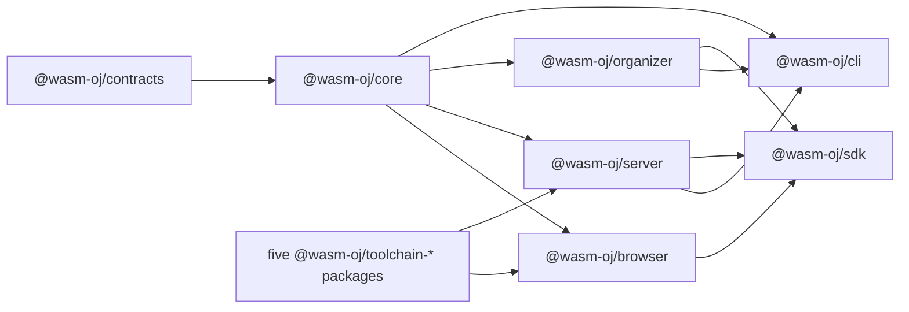
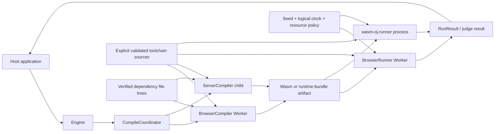

# Architecture

## Package and host boundaries

```mermaid
flowchart LR
  CT["@wasm-oj/contracts"] --> CO["@wasm-oj/core"]
  CO --> BR["@wasm-oj/browser"]
  CO --> SE["@wasm-oj/server"]
  CO --> OR["@wasm-oj/organizer"]
  CO --> CLI["@wasm-oj/cli"]
  SE --> CLI
  OR --> CLI
  BR --> SDK["@wasm-oj/sdk"]
  SE --> SDK
  OR --> SDK
  TC["five @wasm-oj/toolchain-* packages"] --> BR
  TC --> SE
```

Contracts own only environment-neutral identities and wire types. Core owns orchestration and
interfaces, not browser or Node.js I/O. Browser, server, and Organizer are sibling adapters. The
umbrella SDK re-exports these packages and does not embed duplicate core code. The CLI composes
core, server, and Organizer behind the single `woj` executable. Toolchain packages are independent
content releases registered explicitly with a host.

## Compile and execution flow

```mermaid
flowchart LR
  UI["Host application"] --> EN["Engine"]
  EN --> CC["CompileCoordinator"]
  CC --> BC["BrowserCompiler Worker"]
  CC --> SC["ServerCompiler child"]
  TS["Explicit validated toolchain sources"] --> BC
  TS --> SC
  DB["Verified dependency file trees"] --> BC
  DB --> SC
  BC --> ART["Wasm or runtime-bundle artifact"]
  SC --> ART
  ART --> BR["BrowserRunner Worker"]
  ART --> SR["wasm-oj-runner process"]
  TS --> BR
  TS --> SR
  DET["Seed + logical clock + resource policy"] --> BR
  DET --> SR
  BR --> RES["RunResult / judge result"]
  SR --> RES
  RES --> UI
```

Browser requests cross dedicated module-Worker boundaries. C/C++ retains bounded immutable Clang
and content-addressed graph state; Rust and Go use serialized nested stages with bounded generation
lifetime; Python stages are disposable. Server builds use a fresh isolated child. Cancellation,
restart, timeout, cache clearing, disposal, family switch, and stage-budget exhaustion establish a
complete browser Worker-generation boundary.

The runner is one Rust codebase compiled to browser Wasm and native executables. Both forms admit
the same artifacts, deterministic inputs, resource limits, denied capabilities, filesystem model,
metering, and result schema. Host wall duration can differ and is observational.

## Toolchain admission

Each package descriptor uses `wasm-oj-v2/toolchain-package` and binds languages, profiles, logical
asset paths, byte lengths, SHA-256, and package exports. `browserSource(baseUrl)` names the exact
HTTP directory; `serverSource()` names the installed package's exact `file:` directory.

The host validates the complete source list before allocating runtime state. Every language,
profile, and asset has one owner. Browser fetches and server reads verify descriptor size/digest
before decompression or execution. There is no implicit CDN, `/toolchains/` default, filesystem
search, registry fetch, or bundled fallback.

## Compilation pipelines

### C and C++

The packaged Clang 22 driver expansion is frozen into exact C17/C++20 debug/release cc1 and LLD
arguments for `wasm32-unknown-wasip1`. Both public `wasip1` and `wasix` profiles consume this same
compiler ABI; `wasix` changes artifact/cache/runtime-profile identity, not emitted bytes for
identical input. The runner validates actual module imports.

Browser compilation directly invokes packaged atoms. Successful clean translation units enter a
content-addressed dependency graph. The browser persists a digest-verified graph in IndexedDB;
warning-producing units are rebuilt because diagnostics cannot be reconstructed faithfully.
`wasm-oj.pch.hpp` selects a separately pinned debug/release libc++ PCH only when its content equals
`WASM_OJ_LIBCXX_PCH_HEADER` exactly.

### Rust

The Rust package contains rustc 1.91.1-dev, its matching `wasm32-wasip1-threads` standard library,
and pinned wasm-ld resources. A browser stage keeps verified immutable package/command handles warm
while creating fresh project directories and command instances for each build. rustc emits the
crate object plus allocator bitcode; a fresh linker command produces the standalone Wasm artifact.
The generation is recycled before its output-ready stage budget is exceeded. Server compilation
uses the same content and arguments in a one-shot child.

The resulting shared-memory module remains a `wasip1` artifact. The host supplies imported memory
but denies guest thread spawning.

### Go

The Go package contains the standard Go 1.26.5 `compile` and `link` commands and a deterministic
`WOJGO002` archive of the matching `GOOS=wasip1 GOARCH=wasm` standard library. Browser builds use a
serialized persistent stage; server builds use a fresh child. No host Go executable participates
in user compilation.

### Python

The Python package contains source-built CPython 3.14.6 and its pruned standard library. Build
stages checked-hash compile project files and produce a runtime bundle. Execution restores the
verified `WOJFS002` filesystem archive and launches the pinned CPython/WASI entry.

### JavaScript and TypeScript

The native TypeScript 7.0.2 compiler is built as a WASI module and receives files through a bounded
JSON protocol. JavaScript uses the same parser/checker/emit path with `allowJs` and `checkJs`.
Artifacts are CommonJS runtime bundles executed by QuickJS-ng 0.15.1 through the pinned WASI
adapter.

## Build identity and caching

Build identity contains project/source identity, entry, language, target, optimization, compiler
cache identity, explicit descriptor assets, and verified dependency lock/tree digests. Runtime
stdin, arguments, environment, seed, clock, and resource limits do not affect compilation.

`CompileCoordinator` serializes build state. A foreground build can join an exact matching
precompile; editing a build input supersedes stale speculative work. Cached artifacts are returned
only after full metadata and content validation. A cache miss never changes the selected compiler
or toolchain source.

## Runtime policy

Before instantiation the runtime validates the module, removes non-semantic debug/name sections,
preserves required runtime metadata, and injects a mutable 64-bit weighted instruction meter. The
budget is present before a start section can execute. Static original-opcode counts and normalized
cost are reported separately from injected meter instructions.

Contract 2 enforces:

- weighted instruction budget;
- deterministic logical time;
- peak 32-bit linear memory;
- combined stdout/stderr and collected-output bytes;
- live filesystem bytes and inode growth; and
- a host-only wall deadline.

Randomness and clocks derive only from explicit `randomSeed`, `realtimeEpochMs`, and
`clockStepNs`. Supported network, socket, process-spawn, and thread-spawn imports become
signature-preserving deterministic traps; unknown imports fail admission.

## Judging

Each submission compiles once. Every case creates a fresh run configuration and runtime instance.
Batch matchers cover text, digest, token, float, set/multiset, output-file sets, and sandboxed Wasm
checkers. Interactive judging runs contestant and interactor concurrently through bounded
full-duplex pipes with independent resource policy and secret files visible only to the interactor.

Each case executes once under broad hard limits. The same correctness result and metrics are
evaluated against ordered cumulative policies. `instructionBudget` is the portable scoring
boundary; host wall time is never an algorithm-efficiency score.

## Organizer and Online Judge

The Organizer reads exact-commit collection files and validates canonical schema, normalized paths,
sizes, digests, redaction, and deployable `WOJJDG02` structure. It does not compile, run, benchmark,
score, or assess reference solutions and never starts a Container.

Official Submit accepts source, resolves an already published immutable judge package, and starts a
one-shot Container without public dependency network. The Container recompiles the user's source,
executes cases, and returns an authorized aggregate. Client artifacts, limits, hidden data, and
verdicts are untrusted.

## Storage

Browser project/artifact/dependency/build-graph/runtime/toolchain stores use contract-2 names.
`StorageCoordinator` serializes admission and maintenance with a Web Lock and evicts exact
metadata-backed entries by retention and LRU. Invalid metadata or digest removes an entry rather
than estimating or trusting it.

Server caches live under an explicit non-root directory and use atomic content-addressed files.
Neither browser nor server cache is an authority: content is revalidated when consumed.

## Protocols

Browser Worker requests are discriminated structured-clone unions. Server compiler/preparation
children use private bounded one-shot response files; the native runner uses bounded request and
response transport. Long work reports typed progress phases.

Contract-2 binary magic is `WOJRPL02` for replay, `WOJJDG02` for judge packages, `WOJFS002` for
runtime files, and `WOJGO002` for Go shared files. Readers do not probe old formats.

See [library-contract.md](library-contract.md) for invariant details and
[integration-guide.md](integration-guide.md) for public usage.
